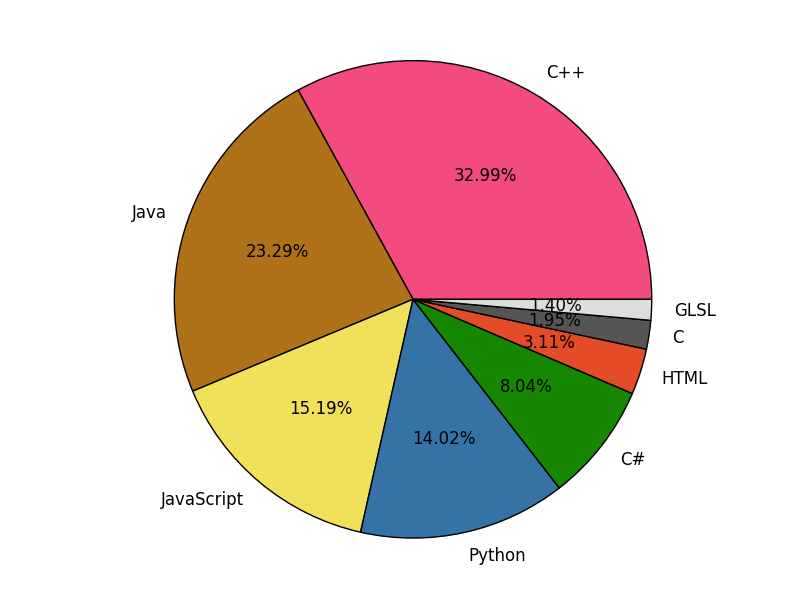
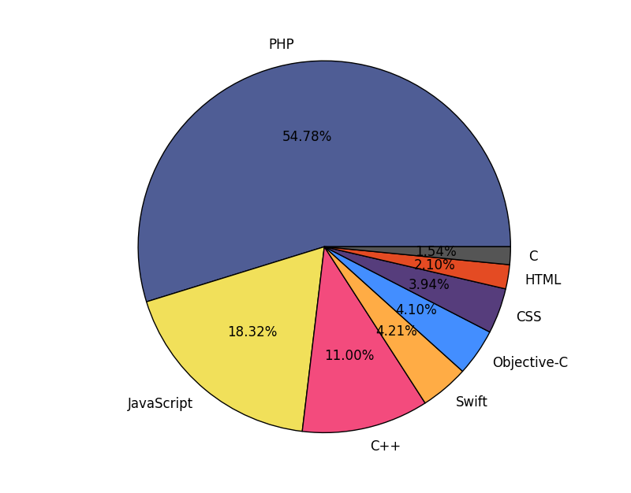

# RepoLanguageAnalyzer
Python script to generate a pie chart of which languages are used in a GitHub user's repos.

This was my first attempt at doing something cool with the GitHub API. I think it turned out well :)

## My Code Distribution

These are the languages I use most frequently in my repositories, according to my script (why does the color for Java have to be so ugly??):

## Some Other Results

Here are some charts for a couple of my close friends:

#### Sameet Sapra (sameetandpotatoes)

#### Andrew Tran (andrewtran634)

#### Loic Sharma (loic-sharma)

